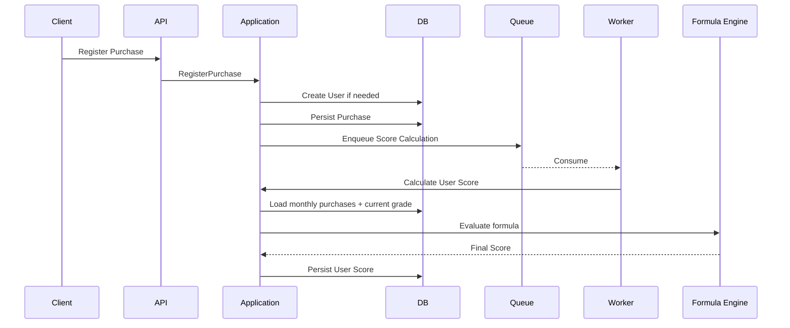

# Score Crafter

a simple solution for grading and scoring customers based on dynamic rules

```For more Information See the video in the root folder of this repository.```

## Solution contents:

1- **ScoreCrafter.Domain**:

High-level abstractions, entities, DTOs, exceptions, invariants, enums, value objects

2- **ScoreCrafter.Application**:

Domain use cases, commands, queries and business logic

3- **ScoreCrafter.Infrastructure**:

Low-level implementations such as database and transactions

4- **ScoreCrafter.Api**:

REST, gRPC and transport adapters

5- **ScoreCrafter.Tests**:

Unit and integration tests

6- **ScoreCrafter.Externals**:

Mocks for expected external services

## Architecture Design Notes:

* **Data modeling:**

ScoreCrafter assumes it lives inside a microservice environment. It does not own user/purchase master data and does not generate their IDs.

* **Purchase flow:**

A purchase is treated as a fulfillment event and triggers one score recalculation.



* **Calculating score:**

Score calculation is asynchronous and runs through an in-memory queue/worker.

* **Dynamic Formula:**

Score rules are stored as versioned dynamic formulas instead of hardcoded business logic, allowing rule changes without code changes.

* **Grade:**

User grade is managed separately from score calculation. Customer type is represented by a fixed numeric value used by the formula.

* **Transactions:**

Database operations use transaction ownership semantics to support nested transaction scopes.

## How to test:

REST: `http://localhost:7000`

gRPC: `https://localhost:7001`

Postman gRPC uses server reflection to discover the available services and methods.

gRPC contracts are Code-First using `protobuf-net.Grpc`; no `.proto` files are required by the API.

## Todo Improvement:

* Cache formula parsing/evaluation; parsed formulas can be kept in first-level cache.
* Hot entities can use second-level/distributed cache with short expiration.
* Persisting grade needs a distributed lock to prevent race conditions.
* Current formula references grades by `GradeId`; a stable business-level reference should be used instead.
* The current in-memory queue is not durable; production implementation should use a persistent queue/outbox.
* Score calculation can be retried/dead-lettered in a production queue.
* User/purchase data ownership remains external by design.


## Appendix: Postman Setup & Testing

### REST

Run the API with:

```bash
dotnet run --project ScoreCrafter.Api
```

REST endpoint:

```text
http://localhost:7000
```

Import the exported REST collection into Postman and send the requests against the local API.

### gRPC

gRPC endpoint:

```text
https://localhost:7001
```

The API exposes Code-First gRPC contracts through server reflection.

In Postman:

1. Create a new **gRPC Request**
2. Enter:

```text
https://localhost:7001
```

3. Use **Reflection** to load the available services
4. Select the required service and method
5. Edit the generated request body and send

For local HTTPS certificate issues:

```bash
dotnet dev-certs https --trust
```

### Suggested Test Flow

1. Create a **Grade**
2. Create a **Formula** for the grade
3. Assign the grade to a user
4. Register a **Purchase**
5. Wait for the asynchronous score calculation
6. Get the user summary and verify the calculated score
7. Use **Test Formula** to validate formula changes independently

### Notes

* REST requests can be exported/imported as a Postman Collection.
* gRPC requests use Postman's reflection support and do not require `.proto` files.
* The gRPC contracts use Code-First `protobuf-net.Grpc`.
* `Guid`, `decimal` and `DateTime` are serialized by `protobuf-net`; Postman may display their generated wire representation instead of conventional JSON values.


### gRPC Testing with grpcurl

The following commands can be used to test the gRPC API directly with `grpcurl`.

#### Create Formula

```bash
grpcurl \
    -insecure \
    -emit-defaults \
    -d '{"Definition":"( PurchaseAmount / IF( CustomerType == 1, 100, IF( CustomerType == 2, 80, 60 ) ) ) * ( 1 + IF( PurchaseCount >= 5, 0.10, 0 ) + IF( PurchaseAmount > 10000000, 0.05 + FLOOR( (PurchaseAmount - 10000000) / 10000000 ) * 0.025, 0 ) )","Version":1}' \
    'localhost:7001' \
    ScoreCrafter.SDK.Model.gRpc.Contractc.FormulaService.CreateFormula
```

#### Create Grade

```bash
grpcurl \
    -insecure \
    -emit-defaults \
    -d '{"Description":"Gold","Name":"Gold"}' \
    'localhost:7001' \
    ScoreCrafter.SDK.Model.gRpc.Contractc.GradeService.CreateGrade
```

#### Register a new Purchase

```bash
grpcurl \
	-insecure \
	-emit-defaults \
	-d '{"Amount":{"hi":0,"lo":"5000000","signScale":0},"Metadata":{"adipisicing occaecat":"incididunt exercitation","Duis eu laborum":"officia voluptate anim","mollit exercitation ipsum cupidatat ut":"irure dolore"},"PurchaseDate":{"kind":1,"scale":4,"value":"9538"},"PurchaseId":{"hi":"5","lo":"905"},"UserId":{"hi":"9","lo":"9"}}' \
	'localhost:7001' \
	ScoreCrafter.SDK.Model.gRpc.Contractc.PurchaseService.RegisterPurchase
```

#### Get User

```bash
grpcurl \
    -insecure \
    -emit-defaults \
    -d '{"UserId":{"hi":"9","lo":"9"}}' \
    'localhost:7001' \
    ScoreCrafter.SDK.Model.gRpc.Contractc.UserService.GetUser
```
#### Set User Grade

```bash
grpcurl \
    -insecure \
    -emit-defaults \
    -d '{"GradeId":3,"UserId":{"hi":"9","lo":"9"}}' \
    'localhost:7001' \
    ScoreCrafter.SDK.Model.gRpc.Contractc.UserService.SetUserGrade
```

> `-insecure` is used because the local gRPC endpoint uses the development HTTPS certificate.

> `Guid`, `decimal`, and `DateTime` values are represented using `protobuf-net`'s generated wire format. The examples above use the format generated by the service's reflection metadata.
